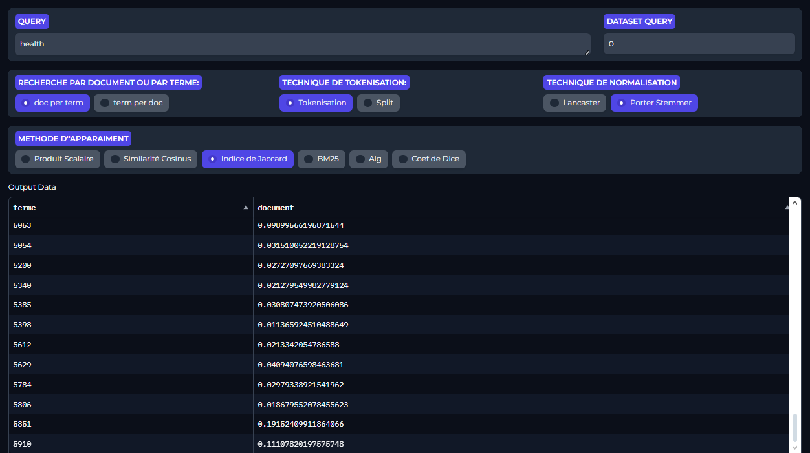
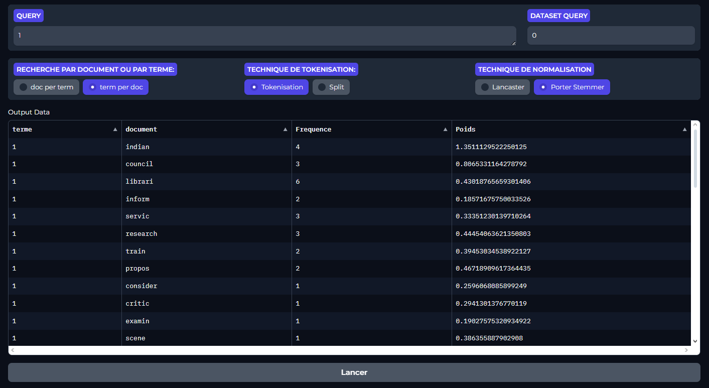

# Search engine

The develped search engine allows users to search for information using customizable parameters. It leverages advanced information retrieval techniques, the search engine efficiently indexes and retrieves relevant documents based on the model chosen by the user. For the evaluation phase of the numerous models developed, we utilized LISA dataset, a collection  publicly accessible through the University of Glasgow's link:
[http://ir.dcs.gla.ac.uk/resources/test_collections/](http://ir.dcs.gla.ac.uk/resources/test_collections/)

## Installation 🛠️

Prerequisite: found in `requirements.txt`

The project is organised as the following:

- 'Collection' folder contains the files accumulating 6004 text documents to search from.
* 'pertinence' folder is for the tests, it contains
    - A file named "LISA.QUE" containing 35 queries.
    - A file named "LISA.REL" containing a correct list of query-document matches (relevance judgments).

- "resultats" folder contains the generated indexed documentso re-generate them un-comment the rest of  `guoigol.ipynb` otherwise just rune the file as it is.
 

## Usage/Examples 

Given a query we get as results documents in order of relevence based on selected tokenisation, nomalisation and query matching techniques

  

We can display all the generated normalized tokens of a given document with the "term per doc" option

  

We can select one of the queries dataset and Evaluate its performance with different retrieval models and visualize precision-recall curves.

  

## License 📜

[creativecommons](https://creativecommons.org/licenses/by-nc-sa/4.0/)
